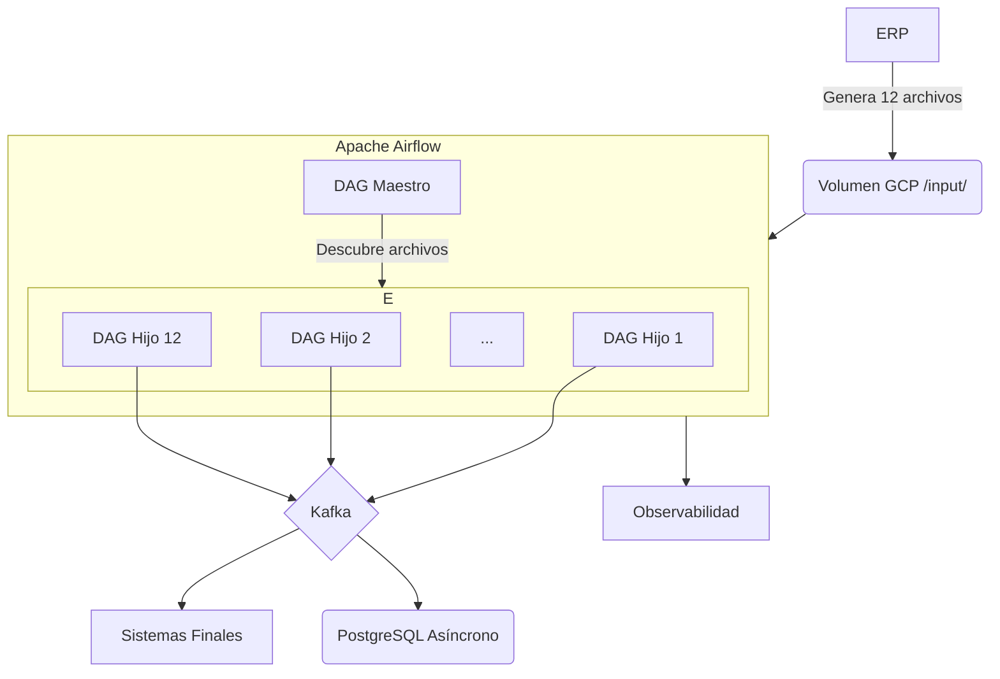

# Repositorio: Ingesta de Maestras ERP para Grupo Éxito

## Descripción General

Este repositorio contiene la solución completa para la ingesta diaria de 12 archivos de maestras desde el ERP de Grupo Éxito. La solución está construida con Apache Airflow y sigue las mejores prácticas de ingeniería de datos, incluyendo procesamiento paralelo, validación de datos, y observabilidad.

## Caso de Uso

**Caso de Uso 1: Ingesta Diaria de 12 Archivos de Maestras**

- **Fuente:** 12 archivos de texto de ancho fijo (fixed-width) generados diariamente por el ERP
- **Procesamiento:** Orquestado por Apache Airflow
- **Validación:** Calidad de datos asegurada con validadores personalizados
- **Distribución:** Publicación en Apache Kafka para consumo de sistemas finales
- **Persistencia:** Carga asíncrona a PostgreSQL como Master Data Hub
- **Observabilidad:** Métricas en Prometheus, dashboards en Grafana, logs en Loki

## Arquitectura

La solución sigue una arquitectura Event-Driven con un enfoque híbrido:



**Componentes Clave:**

- **DAG Maestro:** Orquesta el flujo completo
- **DAGs Hijos:** Procesan cada archivo individualmente
- **Parser de Fixed-Width:** Módulo genérico para parsear archivos
- **Validadores:** Aseguran la calidad de los datos
- **Kafka:** Bus de eventos para distribución desacoplada
- **PostgreSQL:** Master Data Hub con carga asíncrona

## Estructura del Repositorio

```
erp-maestras-ikitech/
├── dags/                 # Código de los DAGs
│   └── masterdata_ikitech/
│       ├── dag_ingesta_diaria_maestras.py
│       ├── dag_procesamiento_archivo_maestra.py
│       ├── config/         # Configuraciones
│       ├── parsers/        # Módulo de parseo
│       ├── validators/     # Módulo de validación
│       ├── sql/            # Scripts SQL
│       └── utils/          # Utilidades compartidas
├── docs/                 # Documentación técnica
├── tests/                # Pruebas unitarias y de integración
├── pipeline/             # Pipeline de CI/CD (Azure DevOps)
├── catalog-info.yaml     # Integración con Backstage
├── mkdocs.yml            # Configuración de MkDocs
├── pyproject.toml        # Dependencias (Poetry)
└── README.md             # Este archivo
```

## Configuración

### Variables de Airflow

- `gcp_input_path`: Ruta de la carpeta de input
- `gcp_processed_path`: Ruta de la carpeta de procesados
- `gcp_error_path`: Ruta de la carpeta de errores
- `kafka_bootstrap_servers`: Servidores de Kafka
- `kafka_topic_prefix`: Prefijo para los topics de Kafka
- `postgres_conn_id`: ID de la conexión a PostgreSQL

### Configuración de Layouts

El archivo `dags/masterdata_ikitech/config/layouts.json` contiene la configuración de parseo para cada uno de los 12 archivos.

### Mapeo Archivo-Tabla

El archivo `dags/masterdata_ikitech/config/file_table_mapping.json` contiene el mapeo entre archivos, tablas destino, y topics de Kafka.

## Cómo Empezar

### 1. Prerrequisitos

- Apache Airflow 2.8+
- Python 3.11+
- Poetry para gestión de dependencias
- Acceso a GCP, Kafka, y PostgreSQL

### 2. Instalación

```bash
# Clonar el repositorio
git clone <url_del_repositorio>
cd erp-maestras-ikitech

# Instalar dependencias
poetry install
```

### 3. Configuración

1. Configurar las variables de Airflow en la UI
2. Asegurar que los archivos de configuración en `dags/masterdata_ikitech/config/` estén correctos

### 4. Ejecución

El DAG `ingesta_diaria_maestras_erp` se ejecutará automáticamente según el schedule (diario a las 2 AM). También se puede disparar manualmente desde la UI de Airflow.

## Pruebas

Para ejecutar las pruebas:

```bash
poetry run pytest
```

##  Documentación

La documentación técnica completa se puede generar con MkDocs:

```bash
poetry run mkdocs serve
```

## Contribuciones

- **Equipo:** IkiTech
- **Contacto:** data-team@ikitech.com

Para contribuir, por favor seguir el flujo de GitFlow:
1. Crear una rama `feature/` desde `develop`
2. Implementar la funcionalidad
3. Crear un Pull Request a `develop`

## Licencia

Este proyecto es propiedad de Grupo Éxito y está bajo una licencia privada.
