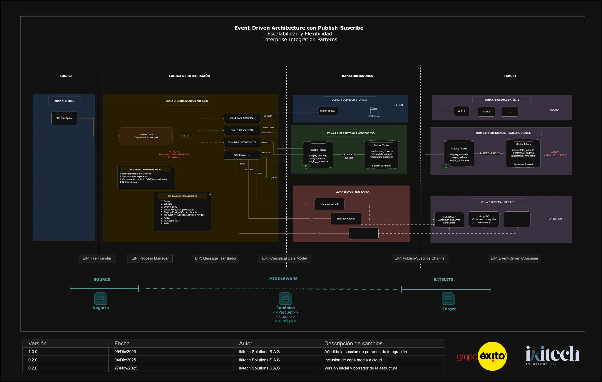
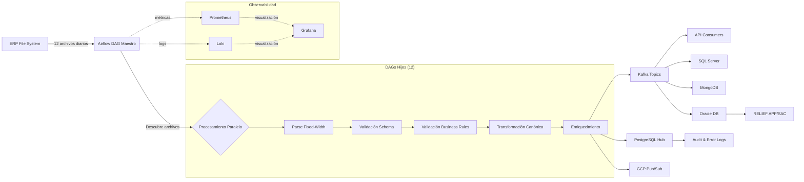

# Repositorio: Ingesta de Maestras ERP para Grupo Éxito

## Descripción General

Este repositorio contiene la solución completa para la ingesta diaria de 12 archivos de maestras desde el ERP de Grupo Éxito. La solución está construida con Apache Airflow siguiendo una arquitectura **Event-Driven con patrones Publish-Subscribe**, implementando las mejores prácticas de Enterprise Integration Patterns (EIP) para garantizar escalabilidad, flexibilidad y desacoplamiento entre sistemas.

## Caso de Uso

**Ingesta Diaria de 12 Archivos de Maestras ERP**

- **Fuente:** 12 archivos de texto de ancho fijo (fixed-width) generados diariamente por el ERP
- **Procesamiento:** Orquestado por Apache Airflow con procesamiento paralelo
- **Validación:** Calidad de datos asegurada con validadores personalizados (reglas de negocio, tipos de datos, integridad referencial)
- **Transformación:** Conversión de formato fixed-width a JSON canónico
- **Distribución:** Publicación en Apache Kafka para consumo desacoplado por sistemas finales
- **Persistencia:** Carga a múltiples destinos (PostgreSQL, Oracle, MongoDB, SQL Server)
- **Observabilidad:** Métricas en Prometheus, dashboards en Grafana, logs en Loki

## Arquitectura

La solución implementa una **Arquitectura Event-Driven con Publish-Subscribe**, siguiendo los patrones de Enterprise Integration Patterns (EIP) para garantizar escalabilidad y flexibilidad.



### Zonas de la Arquitectura

#### **ZONA 1: SOURCE (Origen)**
- **Componente:** ERP File System
- **Descripción:** Sistema ERP que genera diariamente 12 archivos de maestras en formato fixed-width
- **Patrón EIP:** File Transfer

#### **ZONA 2: LÓGICA DE INTEGRACIÓN (Orquestación Airflow)**
- **Componente Principal:** Apache Airflow
- **Responsabilidades:**
  - **Orquestador Principal:** DAG maestro que descubre archivos y dispara procesamiento
  - **DAGs Hijos:** Procesan cada archivo individualmente en paralelo
  - **Validaciones:** 
    1. Parser (conversión de fixed-width a estructurado)
    2. Schema validation (tipos de datos, campos requeridos)
    3. Business rules (reglas de negocio específicas por maestra)
    4. Data quality (completitud, consistencia)
    5. Transformación a modelo canónico (JSON)
    6. Enriquecimiento (metadatos, timestamps)
    7. Logging en GCP
    8. Audit trail
- **Patrón EIP:** Process Manager, Message Translator

#### **ZONA 3: TRANSFORMADORES - GCP Pub/Sub + Storage**
- **Componentes:**
  - **GCP Pub/Sub:** Sistema de mensajería para eventos en tiempo real
  - **Cloud Storage:** Almacenamiento de archivos procesados y logs
  - **Master Tables:** Tablas maestras en la nube
- **Patrón EIP:** Canonical Data Model

#### **ZONA 4: TRANSFORMADORES - Persistencia PostgreSQL**
- **Componente:** PostgreSQL Master Data Hub
- **Descripción:** Base de datos central que almacena todas las maestras procesadas
- **Tablas:** 
  - `staging_tables` (datos temporales)
  - `master_tables` (datos consolidados)
  - `audit_log` (trazabilidad)
  - `error_log` (errores de procesamiento)
- **System of Record:** Fuente de verdad para datos maestros

#### **ZONA 5: TRANSFORMADORES - Event Bus Kafka**
- **Componente:** Apache Kafka
- **Descripción:** Bus de eventos para distribución desacoplada a sistemas finales
- **Topics:** Un topic por cada maestra (ej: `maestras.moneda`, `maestras.cadena`)
- **Configuración:**
  - Log compaction habilitado (retención de última versión por key)
  - Replication factor: 1 (desarrollo), 3+ (producción)
  - Consumer groups para cada sistema consumidor
- **Patrón EIP:** Publish-Subscribe Channel

#### **ZONA 6: TARGET - Sistemas Satélite (APIs)**
- **Componentes:**
  - **API 1, API 2, API 3:** Aplicaciones que consumen eventos de Kafka
  - **Cloud:** Servicios en la nube
- **Patrón EIP:** Event-Driven Consumer

#### **ZONA 7: TARGET - Sistemas Satélite (SQL Server + MongoDB)**
- **Componentes:**
  - **SQL Server:** Base de datos relacional para consumidores específicos
  - **MongoDB:** Base de datos NoSQL para consumidores que requieren flexibilidad
- **Patrón EIP:** Event-Driven Consumer

#### **ZONA 8: TARGET - Persistencia Satélite Oracle**
- **Componentes:**
  - **Oracle Database:** Sistema legado que consume maestras
  - **RELIEF APP/SAC:** Aplicaciones que consumen desde Oracle
  - **System of Record:** Oracle como fuente de verdad para sistemas legados
- **Patrón EIP:** Direct Data Integration

### Capas de la Arquitectura (SOURCE → MIDDLEWARE → SATELLITE)

```
┌─────────────┐     ┌──────────────────────┐     ┌─────────────────┐
│   SOURCE    │────▶│     MIDDLEWARE       │────▶│    SATELLITE    │
│             │     │                      │     │                 │
│ ERP System  │     │ Airflow Orchestrator │     │ Target Systems  │
│             │     │ PostgreSQL Hub       │     │ (APIs, DBs)     │
│             │     │ Kafka Event Bus      │     │                 │
└─────────────┘     └──────────────────────┘     └─────────────────┘
    Negocio              Canónico                      Target
                        <Parquet>                    <entity>
                        <entity>
```

### Flujo de Datos Completo



## Componentes Clave

### 1. DAG Maestro (`ingesta_diaria_maestras_erp`)
- **Schedule:** Diario a las 2 AM
- **Responsabilidades:**
  - Descubrir archivos en el directorio `/input/`
  - Disparar DAGs hijos en paralelo (uno por archivo)
  - Consolidar resultados de ejecución
  - Enviar notificaciones en caso de errores
  - Registrar métricas de ejecución

### 2. DAG Hijo (`procesamiento_archivo_maestra`)
- **Schedule:** Disparado por el DAG maestro
- **Responsabilidades:**
  1. **Parser:** Convertir archivo fixed-width a formato estructurado
  2. **Schema Validation:** Validar tipos de datos y campos requeridos
  3. **Business Rules:** Aplicar reglas de negocio específicas
  4. **Data Quality:** Verificar completitud y consistencia
  5. **Transformación:** Convertir a modelo canónico (JSON)
  6. **Enriquecimiento:** Agregar metadatos (timestamp, source, version)
  7. **Publicación Kafka:** Enviar eventos a topics correspondientes
  8. **Persistencia PostgreSQL:** Guardar en Master Data Hub
  9. **Archivo:** Mover archivo a `/processed/` o `/error/`
  10. **Audit:** Registrar en `audit_log` tabla

### 3. Parser de Fixed-Width
- **Módulo:** `parsers.fixed_width_parser`
- **Clase:** `FixedWidthParser`
- **Configuración:** `config/layouts.json`
- **Funcionalidad:** Lee archivos de ancho fijo y los convierte a diccionarios Python

### 4. Validadores
- **Módulo:** `validators.validators`
- **Clase:** `DataValidator`
- **Tipos de validación:**
  - Schema validation (tipos, requeridos, longitudes)
  - Business rules (reglas específicas por maestra)
  - Data quality (completitud, unicidad, integridad referencial)
  - Cross-field validation (validaciones entre campos)

### 5. Apache Kafka (Event Bus)
- **Propósito:** Distribución desacoplada de eventos a sistemas finales
- **Topics:** Un topic por maestra con log compaction
- **Consumer Groups:** Cada sistema consumidor tiene su propio grupo
- **Ventajas:**
  - Desacoplamiento entre productores y consumidores
  - Escalabilidad horizontal
  - Replay de eventos
  - Garantía de entrega (at-least-once)

### 6. PostgreSQL Master Data Hub
- **Propósito:** Sistema de registro (System of Record) para datos maestros
- **Esquema:**
  - `staging_*` tables: Datos temporales durante procesamiento
  - `master_*` tables: Datos consolidados y validados
  - `audit_log`: Trazabilidad de todas las operaciones
  - `error_log`: Registro de errores de validación

### 7. Observabilidad Stack
- **Prometheus:** Recolección de métricas de Airflow, PostgreSQL
- **Grafana:** Dashboards de monitoreo (Airflow Overview, System Overview)
- **Loki:** Agregación de logs
- **StatsD Exporter:** Exporta métricas de Airflow a Prometheus
- **Postgres Exporter:** Exporta métricas de PostgreSQL a Prometheus

## Estructura del Repositorio

```
ikitech-grupo-exito-c1/
├── dags/                           # Código de los DAGs
│   └── masterdata_ikitech/
│       ├── dag_ingesta_diaria_maestras.py       # DAG maestro
│       ├── dag_procesamiento_archivo_maestra.py # DAG hijo
│       ├── config/                 # Configuraciones
│       │   ├── layouts.json        # Layouts de archivos fixed-width
│       │   └── file_table_mapping.json  # Mapeo archivo-tabla-topic
│       ├── parsers/                # Módulo de parseo
│       │   └── fixed_width_parser.py
│       ├── validators/             # Módulo de validación
│       │   └── validators.py
│       ├── sql/                    # Scripts SQL
│       │   └── db_masterdata_hub.sql
│       └── utils/                  # Utilidades compartidas
├── docs/                           # Documentación técnica
│   ├── architecture-diagram.png    # Diagrama de arquitectura aprobado
│   ├── observability_stack.md      # Documentación de observabilidad
│   └── index.md                    # Índice de documentación
├── observability/                  # Stack de observabilidad
│   ├── prometheus/
│   │   ├── prometheus-windows.yml  # Configuración de Prometheus
│   │   └── statsd-mapping.yml      # Mapeo de métricas StatsD
│   ├── grafana/
│   │   ├── provisioning/           # Datasources y dashboards
│   │   └── dashboards/             # Dashboards JSON
│   └── loki/
│       └── loki-config.yml         # Configuración de Loki
├── docker-compose.yml              # Stack principal (Airflow, Kafka, PostgreSQL, Oracle)
├── docker-compose.observability-windows.yml  # Stack de observabilidad
├── start-observability-windows.ps1 # Script de inicio para Windows
├── Dockerfile                      # Imagen de Airflow customizada
├── requirements.txt                # Dependencias Python
└── README.md                       # Este archivo
```

## Configuración

### Variables de Airflow

Configurar en la UI de Airflow (`Admin` → `Variables`):

| Variable | Descripción | Ejemplo |
|----------|-------------|---------|
| `gcp_input_path` | Ruta de la carpeta de input | `/input/` |
| `gcp_processed_path` | Ruta de la carpeta de procesados | `/processed/` |
| `gcp_error_path` | Ruta de la carpeta de errores | `/error/` |
| `kafka_bootstrap_servers` | Servidores de Kafka | `kafka:29092` |
| `kafka_topic_prefix` | Prefijo para los topics de Kafka | `maestras.` |
| `postgres_conn_id` | ID de la conexión a PostgreSQL | `postgres_masterdata` |

### Configuración de Layouts

El archivo `dags/masterdata_ikitech/config/layouts.json` contiene la configuración de parseo para cada uno de los 12 archivos, especificando:
- Nombre del campo
- Posición inicial
- Longitud
- Tipo de dato
- Transformaciones

### Mapeo Archivo-Tabla-Topic

El archivo `dags/masterdata_ikitech/config/file_table_mapping.json` contiene el mapeo entre:
- Nombre del archivo
- Tabla destino en PostgreSQL
- Topic de Kafka
- Reglas de validación específicas

## Cómo Empezar

### 1. Prerrequisitos

- Docker Desktop (Windows) o Docker Engine (Linux)
- Docker Compose
- PowerShell (Windows) o Bash (Linux)
- 8GB RAM mínimo, 16GB recomendado
- 20GB espacio en disco

### 2. Instalación

```bash
# Clonar el repositorio
git clone https://github.com/ikitech-solutions/ikitech-grupo-exito-c1.git
cd ikitech-grupo-exito-c1

# Crear directorios necesarios
mkdir -p input processed error logs pgdata
```

### 3. Iniciar la Aplicación

**En Windows (PowerShell):**
```powershell
# Iniciar stack principal
docker compose up -d

# Iniciar stack de observabilidad
.\start-observability-windows.ps1
```

**En Linux/Mac (Bash):**
```bash
# Iniciar stack principal
docker-compose up -d

# Nota: El stack de observabilidad está optimizado para Windows
# Para Linux, usar docker-compose.observability.yml (si existe)
```

### 4. Verificar Servicios

```powershell
# Ver estado de todos los contenedores
docker compose ps

# Ver logs de Airflow
docker compose logs airflow-webserver -f
```

### 5. Acceder a las Interfaces

| Servicio | URL | Credenciales |
|----------|-----|--------------|
| **Airflow** | http://localhost:8080 | admin / admin |
| **Grafana** | http://localhost:3000 | admin / admin |
| **Prometheus** | http://localhost:9090 | - |
| **Kafka UI** | (No incluido) | - |

### 6. Configuración Inicial de Airflow

1. Acceder a Airflow: http://localhost:8080
2. Ir a `Admin` → `Variables` y configurar las variables listadas arriba
3. Ir a `Admin` → `Connections` y verificar la conexión `postgres_masterdata`
4. Activar el DAG `ingesta_diaria_maestras_erp`

## Ejecución

### Ejecución Manual

1. Colocar archivos de prueba en el directorio `./input/`
2. Ir a Airflow UI: http://localhost:8080
3. Buscar el DAG `ingesta_diaria_maestras_erp`
4. Hacer clic en el botón "Trigger DAG" (▶️)
5. Monitorear la ejecución en la vista de Graph o Gantt

### Ejecución Automática

El DAG se ejecutará automáticamente todos los días a las 2 AM según el schedule configurado.

### Monitoreo

**En Grafana (http://localhost:3000):**
1. Dashboard "Airflow Overview": Métricas de DAGs, tareas, scheduler
2. Dashboard "System Overview": Métricas de PostgreSQL, conexiones

**En Airflow UI:**
1. Vista de Graph: Ver el flujo de tareas
2. Vista de Logs: Ver logs detallados de cada tarea
3. Vista de Task Duration: Analizar tiempos de ejecución

## Manejo de Errores

### Archivos Inválidos
- **Acción:** Movidos automáticamente a `/error/`
- **Registro:** Entrada en tabla `error_log` con detalles del error
- **Notificación:** Alerta en Airflow (configurar email/Slack)

### Registros Inválidos
- **Acción:** Registros rechazados se guardan en tabla `error_log`
- **Procesamiento:** Los registros válidos continúan su procesamiento
- **Umbral:** Si tasa de error > 5%, se genera alerta

### Fallos de Kafka
- **Acción:** Reintentos automáticos (3 intentos)
- **Fallback:** Si Kafka falla, datos se guardan en PostgreSQL
- **Recuperación:** Replay de eventos desde PostgreSQL cuando Kafka se recupere

### Fallos de PostgreSQL
- **Acción:** Task falla y se marca para retry
- **Reintentos:** 3 intentos con backoff exponencial
- **Alerta:** Notificación inmediata al equipo

## Observabilidad

### Métricas Disponibles

**Airflow:**
- DAG run duration
- Task duration por DAG y task
- Scheduler heartbeat
- Executor slots (open, queued, running)
- Pool slots por pool
- DAG run states (success, failed, running)
- Task states (success, failed, running)

**PostgreSQL:**
- Conexiones activas, idle, máximas
- Database size
- Query performance
- Transaction rate (commits, rollbacks)
- Table sizes
- Index usage

### Dashboards de Grafana

1. **Airflow Overview**
   - Resumen de ejecuciones de DAGs
   - Duración de tareas
   - Estado del scheduler
   - Métricas del executor

2. **System Overview**
   - Estado de PostgreSQL
   - Conexiones y queries
   - Uso de recursos
   - Logs de errores

### Logs

Los logs están disponibles en:
- **Airflow UI:** Logs detallados por tarea
- **Loki:** Agregación centralizada de logs
- **Grafana:** Exploración de logs integrada con métricas

## Despliegue en Producción

### Consideraciones

1. **Kafka:**
   - Aumentar replication factor a 3
   - Configurar múltiples brokers
   - Habilitar autenticación y encriptación

2. **PostgreSQL:**
   - Configurar replicación (master-slave)
   - Backups automáticos diarios
   - Monitoreo de performance

3. **Airflow:**
   - Usar CeleryExecutor o KubernetesExecutor
   - Configurar múltiples workers
   - Habilitar autenticación LDAP/OAuth

4. **Observabilidad:**
   - Configurar Alertmanager para notificaciones
   - Definir SLOs y SLIs
   - Configurar retención de métricas (30+ días)

### CI/CD

El despliegue se realiza automáticamente a través del pipeline de CI/CD en Azure DevOps (configuración pendiente).

## Pruebas

Para ejecutar las pruebas (cuando estén implementadas):

```bash
# Pruebas unitarias
pytest tests/unit/

# Pruebas de integración
pytest tests/integration/

# Pruebas end-to-end
pytest tests/e2e/
```

## Documentación Adicional

- [Documentación de Observabilidad](docs/observability_stack.md)
- [Documentación Técnica Completa](docs/index.md)

## Contribuciones

- **Equipo:** IkiTech Solutions S.A.S
- **Cliente:** Grupo Éxito
- **Contacto:** manuela.larrea@ikitech.com.co, jeferson.mesa@ikitech.com.co

### Flujo de Trabajo (GitFlow)

1. Crear una rama `feature/` desde `develop`
2. Implementar la funcionalidad
3. Crear un Pull Request a `develop`
4. Revisión de código por el equipo
5. Merge a `develop` después de aprobación
6. Release a `main` para producción

## Licencia

Este proyecto es propiedad de Grupo Éxito y está bajo una licencia privada.

---

**Versión:** 1.0.0  
**Fecha:** Diciembre 2025  
**Autor:** IkiTech Solutions S.A.S
