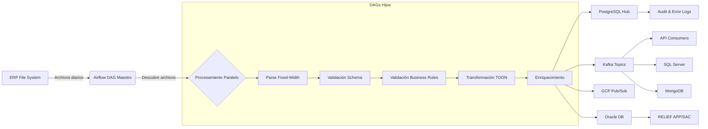

# Arquitectura de la Solución

## Visión General

La solución de ingesta de maestras ERP para Grupo Éxito implementa una **Arquitectura Event-Driven con patrones Publish-Subscribe**, siguiendo las mejores prácticas de Enterprise Integration Patterns (EIP) para garantizar escalabilidad, flexibilidad y desacoplamiento entre sistemas.

## Diagrama de Arquitectura


## Zonas de la Arquitectura

La arquitectura se divide en 8 zonas principales que representan diferentes capas de procesamiento y distribución de datos.

### ZONA 1: SOURCE (Origen)

**Componente:** ERP File System

**Descripción:** Sistema ERP que genera diariamente archivos de maestras en formato fixed-width. Estos archivos contienen información crítica del negocio que debe ser distribuida a múltiples sistemas consumidores.

**Patrón EIP:** File Transfer

### ZONA 2: LÓGICA DE INTEGRACIÓN (Orquestación Airflow)

**Componente Principal:** Apache Airflow

**Responsabilidades:**
- Orquestación de flujos de trabajo mediante DAG maestro
- Procesamiento paralelo de archivos mediante DAGs hijos
- Validación de datos en múltiples niveles
- Transformación a formato canónico (TOON)
- Enriquecimiento de datos con metadatos

**Pasos de Procesamiento:**
1. Parser (conversión de fixed-width a estructurado)
2. Schema validation (tipos de datos, campos requeridos)
3. Business rules (reglas de negocio específicas)
4. Data quality (completitud, consistencia)
5. Transformación a modelo canónico (formato TOON)
6. Enriquecimiento (metadatos, timestamps)
7. Logging en GCP
8. Audit trail

**Patrón EIP:** Process Manager, Message Translator

### ZONA 3: TRANSFORMADORES - GCP Pub/Sub + Storage

**Componentes:**
- GCP Pub/Sub: Sistema de mensajería para eventos en tiempo real
- Cloud Storage: Almacenamiento de archivos procesados y logs
- Master Tables: Tablas maestras en la nube

**Patrón EIP:** Canonical Data Model

### ZONA 4: TRANSFORMADORES - Persistencia PostgreSQL

**Componente:** PostgreSQL Master Data Hub

**Descripción:** Base de datos central que almacena todas las maestras procesadas, actuando como System of Record para datos maestros.

**Esquema de Datos:**
- `staging_*` tables: Datos temporales durante procesamiento
- `master_*` tables: Datos consolidados y validados
- `audit_log`: Trazabilidad de todas las operaciones
- `error_log`: Registro de errores de validación

**Patrón EIP:** System of Record

### ZONA 5: TRANSFORMADORES - Event Bus Kafka

**Componente:** Apache Kafka

**Descripción:** Bus de eventos para distribución desacoplada a sistemas finales. Cada maestra tiene su propio topic con log compaction habilitado.

**Características:**
- Topics con log compaction (retención de última versión por key)
- Consumer groups para cada sistema consumidor
- Mensajes en formato TOON (más compacto que JSON)
- Garantía de entrega at-least-once

**Patrón EIP:** Publish-Subscribe Channel

### ZONA 6: TARGET - Sistemas Satélite (APIs)

**Componentes:**
- API 1, API 2, API 3: Aplicaciones que consumen eventos de Kafka
- Cloud: Servicios en la nube

**Patrón EIP:** Event-Driven Consumer

### ZONA 7: TARGET - Sistemas Satélite (SQL Server + MongoDB)

**Componentes:**
- SQL Server: Base de datos relacional para consumidores específicos
- MongoDB: Base de datos NoSQL para consumidores que requieren flexibilidad

**Patrón EIP:** Event-Driven Consumer

### ZONA 8: TARGET - Persistencia Satélite Oracle

**Componentes:**
- Oracle Database: Sistema legado que recibe datos directamente desde Airflow (no desde Kafka)
- RELIEF APP/SAC: Aplicaciones que consumen desde Oracle

**Integración:** Carga directa desde DAGs de Airflow por solicitud del cliente

**Patrón EIP:** Direct Data Integration

## Capas de la Arquitectura

La arquitectura se organiza en tres capas principales:

```
┌─────────────┐     ┌──────────────────────┐     ┌─────────────────┐
│   SOURCE    │────▶│     MIDDLEWARE       │────▶│    SATELLITE    │
│             │     │                      │     │                 │
│ ERP System  │     │ Airflow Orchestrator │     │ Target Systems  │
│             │     │ PostgreSQL Hub       │     │ (APIs, DBs)     │
│             │     │ Kafka Event Bus      │     │                 │
└─────────────┘     └──────────────────────┘     └─────────────────┘
    Negocio              Canónico                      Target
                         <TOON>                     <entity>
                        <entity>
```

### Capa SOURCE (Negocio)
Contiene los sistemas fuente que generan datos de negocio en formatos propietarios.

### Capa MIDDLEWARE (Canónico)
Procesa, valida, transforma y distribuye datos utilizando un modelo canónico en formato TOON.

### Capa SATELLITE (Target)
Sistemas consumidores que reciben datos en sus formatos específicos.

## Enterprise Integration Patterns (EIP)

La solución implementa los siguientes patrones de integración empresarial:

### 1. File Transfer
Transferencia de archivos desde el ERP al sistema de procesamiento.

### 2. Process Manager
Airflow actúa como orquestador central que coordina el flujo de trabajo completo.

### 3. Message Translator
Transformación de datos desde formato fixed-width al modelo canónico TOON.

### 4. Canonical Data Model
Uso de formato TOON como modelo de datos estándar para toda la capa de middleware.

### 5. Publish-Subscribe Channel
Kafka permite que múltiples consumidores reciban los mismos eventos de forma independiente.

### 6. Event-Driven Consumer
Sistemas satélite consumen eventos de forma asíncrona y desacoplada.

## Formato TOON (Valor Agregado)

La solución utiliza **formato TOON** en lugar de JSON tradicional, proporcionando:

### Ventajas del Formato TOON
- **Mayor compacidad:** Mensajes más pequeños que JSON
- **Mejor legibilidad:** Sintaxis más clara y concisa
- **Mayor eficiencia:** Menor uso de ancho de banda en Kafka
- **Tipado estructurado:** Definición clara de esquemas

### Uso de TOON en la Solución
1. **Configuración de Layouts:** `config/layouts.toon`
2. **Mensajes en Kafka:** Todos los eventos publicados usan formato TOON
3. **Transformación Canónica:** Los datos se convierten a TOON después de validación

### Ejemplo de Layout en TOON

```toon
XWECIA.txt:
  tabla_destino: db_masterdata_hub.erp_COMPANIA
  encoding: utf-8
  tipo: fixed
  campos[2]{nombre,start,end,required}:
    CODCIA,0,2,true
    NOMBRE,2,32,true
  kafka_topic: masterdata.erp.compania
```

## Flujo de Datos Completo



## Observabilidad

La arquitectura incluye un stack completo de observabilidad:

- **Prometheus:** Recolección de métricas de Airflow, PostgreSQL
- **Grafana:** Dashboards de monitoreo (Airflow Overview, System Overview)
- **Loki:** Agregación de logs
- **StatsD Exporter:** Exporta métricas de Airflow a Prometheus
- **Postgres Exporter:** Exporta métricas de PostgreSQL a Prometheus

Ver [Documentación de Observabilidad](observability_stack.md) para más detalles.

## Consideraciones de Diseño

### Escalabilidad
- Procesamiento paralelo de archivos mediante DAGs hijos
- Kafka permite agregar consumidores sin afectar productores
- PostgreSQL puede escalar verticalmente u horizontalmente con replicación

### Resiliencia
- Reintentos automáticos en caso de fallos
- Mensajes persistidos en Kafka para replay
- Logs de auditoría para trazabilidad completa

### Desacoplamiento
- Productores y consumidores no se conocen entre sí
- Cambios en consumidores no afectan al pipeline de ingesta
- Formato canónico TOON facilita integración de nuevos sistemas

### Mantenibilidad
- Código modular y reutilizable
- Configuración centralizada en archivos TOON
- Documentación completa y actualizada

## Próximos Pasos

1. Implementar Alertmanager para gestión de alertas
2. Agregar más dashboards de Grafana según necesidades
3. Configurar replicación de PostgreSQL para alta disponibilidad
4. Implementar encriptación en Kafka para producción
5. Definir SLOs y SLIs para medir confiabilidad del sistema
