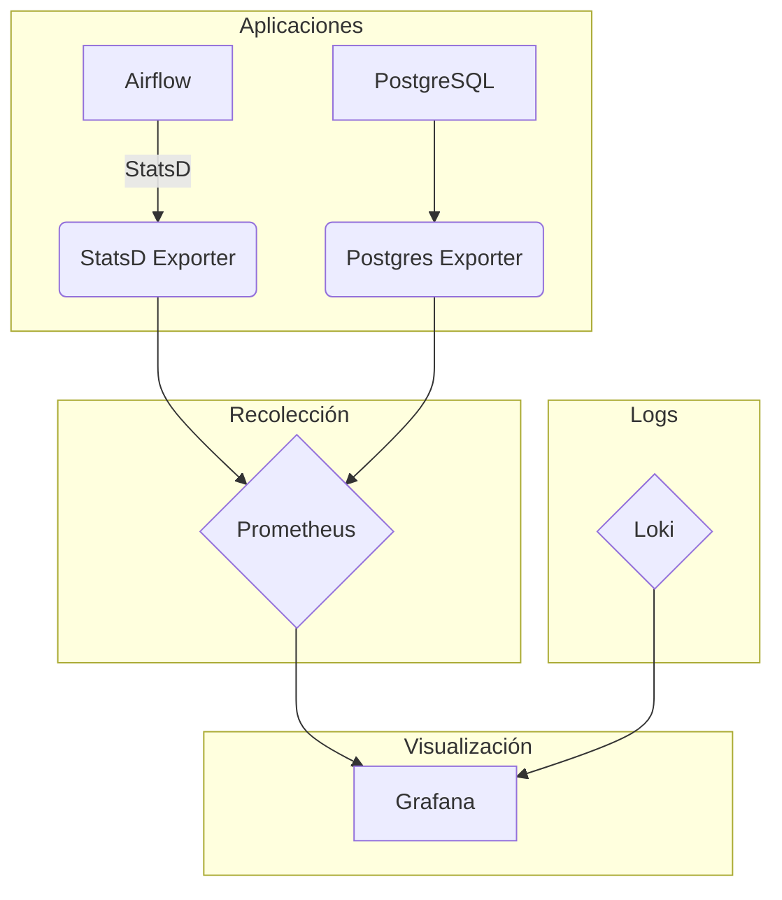

# Documentación de la Capa de Observabilidad

## 1. Introducción

Esta documentación describe la capa de observabilidad implementada para el proyecto de ingesta de datos maestros de Grupo Éxito. La solución se basa en el stack de **Prometheus, Grafana y Loki**, proporcionando una visión completa de las métricas y logs del sistema, optimizada para ejecutarse en entornos Windows con Docker Desktop.

## 2. Componentes del Stack

| Componente | Versión | Propósito | Acceso |
| :--- | :--- | :--- | :--- |
| **Prometheus** | `v2.48.0` | Recolección y almacenamiento de métricas | `http://localhost:9090` |
| **Grafana** | `10.2.2` | Visualización de métricas y logs | `http://localhost:3000` |
| **Loki** | `2.9.3` | Agregación y almacenamiento de logs | `http://localhost:3100` |
| **StatsD Exporter** | `v0.26.0` | Exportador de métricas de Airflow a Prometheus | `http://localhost:9102` |
| **Postgres Exporter** | `v0.15.0` | Exportador de métricas de PostgreSQL a Prometheus | `http://localhost:9187` |

## 3. Arquitectura de Observabilidad

La arquitectura de observabilidad está diseñada para ser desacoplada y escalable, siguiendo las mejores prácticas de la industria y optimizada para Windows.



**Figura 1:** Arquitectura de la Capa de Observabilidad para Windows.

### Flujo de Métricas:

1. Las aplicaciones (Airflow, PostgreSQL) exponen métricas en sus respectivos formatos (StatsD, PostgreSQL stats).
2. Los exportadores (`StatsD Exporter`, `Postgres Exporter`) convierten estas métricas al formato de Prometheus.
3. Prometheus recolecta (scrape) periódicamente estas métricas de los exportadores y las almacena en su base de datos de series temporales (TSDB).
4. Grafana se conecta a Prometheus como datasource para visualizar las métricas en dashboards.

### Flujo de Logs:

1. Loki almacena los logs enviados por las aplicaciones.
2. Los logs se indexan por etiquetas (labels) para una búsqueda eficiente.
3. Grafana se conecta a Loki como datasource para explorar y visualizar los logs.

## 4. Configuración y Despliegue

La capa de observabilidad se despliega utilizando Docker Compose, a través del archivo `docker-compose.observability-windows.yml`.

### Para iniciar el stack de observabilidad (PowerShell):

```powershell
# Usando el script automatizado (recomendado)
.\start-observability-windows.ps1

# O manualmente
docker compose -f docker-compose.observability-windows.yml up -d
```

### Para verificar el estado de los servicios:

```powershell
docker compose -f docker-compose.observability-windows.yml ps
```

### Para ver logs de un servicio específico:

```powershell
docker compose -f docker-compose.observability-windows.yml logs <servicio> --tail=50
```

### Configuración de Airflow:

Las siguientes variables de entorno se han añadido a los servicios de Airflow (`airflow-webserver`, `airflow-scheduler`) en `docker-compose.yml` para habilitar la observabilidad:

- `AIRFLOW__METRICS__STATSD_ON=True`
- `AIRFLOW__METRICS__STATSD_HOST=statsd-exporter`
- `AIRFLOW__METRICS__STATSD_PORT=9125`
- `AIRFLOW__METRICS__STATSD_PREFIX=airflow`

## 5. Dashboards de Grafana

Se han provisionado dos dashboards para monitorear el sistema:

- **Airflow Overview:** Proporciona una visión general del estado de los DAGs, tareas, y el scheduler.
- **System Overview:** Muestra métricas de PostgreSQL, conexiones, y estado general del sistema.

### Cómo acceder a los dashboards:

1. Abre Grafana en `http://localhost:3000`.
2. Inicia sesión con `admin` / `admin`.
3. Navega a `Dashboards` en el menú de la izquierda.
4. Selecciona el dashboard deseado ("Airflow Overview" o "System Overview").

### Métricas disponibles en Airflow Overview:

- **DAG Runs:** Número de ejecuciones de DAGs por estado (success, failed, running)
- **Task Duration:** Duración de las tareas por DAG
- **Scheduler Heartbeat:** Estado del scheduler de Airflow
- **Executor Metrics:** Slots abiertos, tareas en cola, tareas en ejecución
- **Pool Metrics:** Estado de los pools de Airflow

### Métricas disponibles en System Overview:

- **PostgreSQL Connections:** Conexiones activas, idle, y máximas
- **Database Size:** Tamaño de las bases de datos
- **Query Performance:** Rendimiento de consultas
- **Transaction Rate:** Tasa de transacciones (commits, rollbacks)

## 6. Verificación de Targets en Prometheus

Para verificar que Prometheus está recolectando métricas correctamente:

1. Abre Prometheus en `http://localhost:9090`.
2. Navega a `Status` → `Targets`.
3. Verifica que todos los targets estén en estado `UP`:
   - `statsd-exporter` (puerto 9102)
   - `postgres-exporter` (puerto 9187)
   - `prometheus` (puerto 9090)

## 7. Troubleshooting

### StatsD Exporter no inicia:

- Verifica que el archivo `observability/prometheus/statsd-mapping.yml` tenga la sintaxis correcta.
- Revisa los logs: `docker compose -f docker-compose.observability-windows.yml logs statsd-exporter`

### Grafana no muestra dashboards:

- Verifica que los volúmenes estén montados correctamente.
- Reinicia Grafana: `docker compose -f docker-compose.observability-windows.yml restart grafana`

### Prometheus no recolecta métricas:

- Verifica que los exportadores estén en estado `UP` en la página de targets.
- Revisa la configuración en `observability/prometheus/prometheus-windows.yml`.

## 8. Diferencias con la versión Linux

Esta implementación está optimizada para Windows y tiene las siguientes diferencias respecto a una implementación típica en Linux:

**Componentes removidos:**
- **Node Exporter:** No compatible con Windows (requiere acceso directo al sistema operativo host)
- **cAdvisor:** Problemas de compatibilidad con Docker Desktop en Windows
- **Promtail:** Dificultades para acceder a logs del sistema en Windows
- **Marquez/OpenLineage:** Removido por complejidad innecesaria para el caso de uso actual

**Archivos específicos para Windows:**
- `docker-compose.observability-windows.yml`: Configuración optimizada para Windows
- `start-observability-windows.ps1`: Script de PowerShell para despliegue automatizado
- `observability/prometheus/prometheus-windows.yml`: Configuración de Prometheus sin targets incompatibles

## 9. Próximos Pasos y Mejoras

- **Configurar Alertmanager:** Desplegar y configurar Alertmanager para gestionar y enrutar las alertas.
- **Integrar Logs en Dashboards:** Usar la funcionalidad de Grafana para correlacionar métricas y logs en los mismos dashboards.
- **Definir SLOs y SLIs:** Establecer objetivos de nivel de servicio (SLOs) e indicadores de nivel de servicio (SLIs) para medir la fiabilidad del sistema.
- **Segurizar los Endpoints:** Añadir autenticación y autorización a los endpoints de Prometheus, Grafana, etc.
- **Monitoreo de Kafka:** Agregar exportadores para Kafka si se requiere monitoreo detallado del broker.
