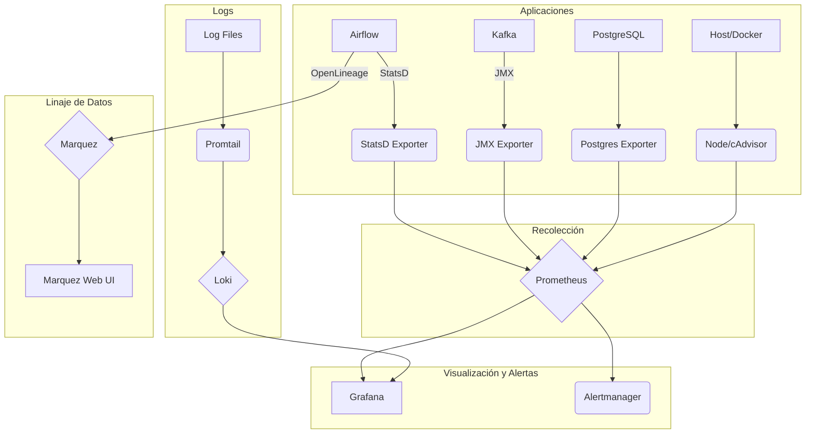

# Documentación de la Capa de Observabilidad

## 1. Introducción

Esta documentación describe la capa de observabilidad implementada para el proyecto de ingesta de datos maestros de Grupo Éxito. La solución se basa en el stack de **Prometheus, Grafana, Loki y Marquez**, proporcionando una visión completa de las métricas, logs y linaje de datos del sistema.

## 2. Componentes del Stack

| Componente | Versión | Propósito | Acceso |
| :--- | :--- | :--- | :--- |
| **Prometheus** | `v2.48.0` | Recolección y almacenamiento de métricas | `http://localhost:9090` |
| **Grafana** | `10.2.2` | Visualización de métricas y logs | `http://localhost:3000` |
| **Loki** | `2.9.3` | Agregación y almacenamiento de logs | `http://localhost:3100` |
| **Promtail** | `2.9.3` | Agente de recolección de logs para Loki | N/A |
| **Marquez** | `0.46.0` | Linaje de datos y gestión de metadatos | `http://localhost:3001` |
| **StatsD Exporter** | `v0.26.0` | Exportador de métricas de Airflow a Prometheus | N/A |
| **Postgres Exporter** | `v0.15.0` | Exportador de métricas de PostgreSQL a Prometheus | N/A |
| **Node Exporter** | `v1.7.0` | Exportador de métricas del sistema (host) | N/A |
| **cAdvisor** | `v0.47.2` | Exportador de métricas de contenedores Docker | N/A |

## 3. Arquitectura de Observabilidad

La arquitectura de observabilidad está diseñada para ser desacoplada y escalable, siguiendo las mejores prácticas de la industria.



**Figura 1:** Arquitectura de la Capa de Observabilidad.

### Flujo de Métricas:

1.  Las aplicaciones (Airflow, Kafka, PostgreSQL) exponen métricas en sus respectivos formatos (StatsD, JMX).
2.  Los exportadores (`StatsD Exporter`, `JMX Exporter`, etc.) convierten estas métricas al formato de Prometheus.
3.  Prometheus recolecta (scrape) periódicamente estas métricas de los exportadores y las almacena en su base de datos de series temporales (TSDB).
4.  Grafana se conecta a Prometheus como datasource para visualizar las métricas en dashboards.
5.  Prometheus evalúa reglas de alerta y envía notificaciones a Alertmanager (configuración pendiente).

### Flujo de Logs:

1.  Promtail monitorea los archivos de log de las aplicaciones y del sistema.
2.  Envía los logs a Loki, enriqueciéndolos con etiquetas (labels) para una indexación eficiente.
3.  Loki almacena los logs y los indexa por etiquetas.
4.  Grafana se conecta a Loki como datasource para explorar y visualizar los logs.

### Flujo de Linaje de Datos:

1.  Airflow, configurado con el backend de OpenLineage, envía metadatos sobre los DAGs, tareas, datasets y ejecuciones a Marquez.
2.  Marquez almacena esta información en su base de datos (PostgreSQL) y construye un grafo de linaje.
3.  La interfaz web de Marquez permite explorar visualmente el linaje de datos, ver cómo se transforman los datos y rastrear dependencias.

## 4. Configuración y Despliegue

La capa de observabilidad se despliega utilizando Docker Compose, a través del archivo `docker-compose.observability.yml`.

### Para iniciar el stack de observabilidad:

```bash
docker-compose -f docker-compose.observability.yml up -d
```

### Para iniciar la aplicación principal (con la observabilidad ya iniciada):

```bash
docker-compose up -d
```

### Configuración de Airflow:

Las siguientes variables de entorno se han añadido a los servicios de Airflow (`airflow-webserver`, `airflow-scheduler`) en `docker-compose.yml` para habilitar la observabilidad:

-   `AIRFLOW__METRICS__STATSD_ON=True`
-   `AIRFLOW__METRICS__STATSD_HOST=statsd-exporter`
-   `AIRFLOW__METRICS__STATSD_PORT=9125`
-   `AIRFLOW__METRICS__STATSD_PREFIX=airflow`
-   `AIRFLOW__LINEAGE__BACKEND=openlineage.lineage_backend.OpenLineageBackend`
-   `OPENLINEAGE_URL=http://marquez:5000`
-   `OPENLINEAGE_NAMESPACE=grupo_exito_c1`

## 5. Dashboards de Grafana

Se ha provisionado un dashboard inicial para Airflow:

-   **Airflow Overview:** Proporciona una visión general del estado de los DAGs, tareas, y el scheduler.

### Cómo acceder a los dashboards:

1.  Abre Grafana en `http://localhost:3000`.
2.  Inicia sesión con `admin` / `admin`.
3.  Navega a `Dashboards` en el menú de la izquierda.
4.  Selecciona el dashboard "Airflow Overview".

## 6. Linaje de Datos con Marquez

Marquez proporciona un valor agregado significativo al permitir visualizar el linaje de datos de todo el pipeline.

### Cómo explorar el linaje:

1.  Abre la interfaz web de Marquez en `http://localhost:3001`.
2.  En el campo de búsqueda, busca un dataset (ej: `maestras.moneda`) o un job (ej: `process_moneda_dag`).
3.  Haz clic en el resultado para ver sus detalles y el grafo de linaje.

**Beneficios para el cliente:**

-   **Trazabilidad:** Entender de dónde vienen los datos y a dónde van.
-   **Análisis de Impacto:** Ver qué sistemas se verán afectados si un dataset o un job falla.
-   **Gobernanza de Datos:** Identificar la propiedad de los datos y su clasificación (PII, sensible, etc.).
-   **Depuración:** Rastrear el origen de datos incorrectos o corruptos.

## 7. Alertas

Se han configurado reglas de alerta básicas en Prometheus para Airflow y Kafka. Estas alertas se pueden integrar con un Alertmanager para enviar notificaciones por email, Slack, etc.

### Alertas de Airflow:

-   `AirflowDAGFailed`: Un DAG ha fallado.
-   `AirflowSchedulerDown`: El scheduler de Airflow no está funcionando.
-   `AirflowTaskQueueHigh`: La cola de tareas está creciendo, indicando posibles problemas de rendimiento.

### Alertas de Kafka:

-   `KafkaBrokerDown`: Un broker de Kafka está caído.
-   `KafkaUnderReplicatedPartitions`: Hay particiones con menos réplicas de las esperadas.
-   `KafkaConsumerLagHigh`: Un consumidor se está quedando atrás en el procesamiento de mensajes.

## 8. Próximos Pasos y Mejoras

-   **Configurar Alertmanager:** Desplegar y configurar Alertmanager para gestionar y enrutar las alertas.
-   **Crear más Dashboards:** Desarrollar dashboards específicos para Kafka, PostgreSQL y el rendimiento del sistema.
-   **Integrar Logs en Dashboards:** Usar la funcionalidad de Grafana para correlacionar métricas y logs en los mismos dashboards.
-   **Definir SLOs y SLIs:** Establecer objetivos de nivel de servicio (SLOs) e indicadores de nivel de servicio (SLIs) para medir la fiabilidad del sistema.
-   **Segurizar los Endpoints:** Añadir autenticación y autorización a los endpoints de Prometheus, Grafana, etc.etc.etc.
